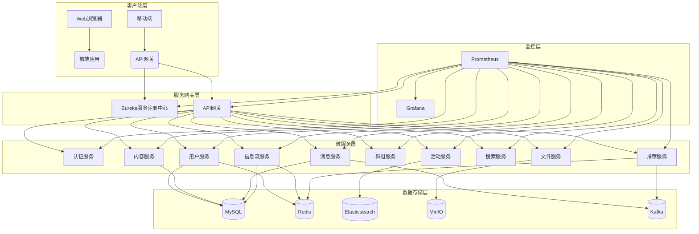

# Nexus平台架构文档

## 1. 整体架构

Nexus平台采用微服务架构，将复杂的业务功能拆分为多个独立的服务，每个服务可以独立开发、部署和扩展。整体架构分为以下几个层次：

## 2. 技术栈

### 2.1 后端技术栈
- **开发框架**：Spring Boot, Spring Cloud
- **服务注册发现**：Eureka
- **API网关**：Spring Cloud Gateway
- **数据库**：MySQL 8.0
- **缓存**：Redis
- **搜索引擎**：Elasticsearch
- **消息队列**：Apache Kafka
- **对象存储**：MinIO
- **监控**：Prometheus, Grafana

### 2.2 前端技术栈
- **开发框架**：React
- **状态管理**：Redux Toolkit
- **UI库**：Material-UI
- **图片处理**：React Image Crop
- **富文本编辑**：Draft.js
- **构建工具**：Vite

## 3. 服务模块说明

### 3.1 基础服务

#### Eureka服务注册中心
负责服务的注册与发现，所有微服务启动时向Eureka注册自己的信息，其他服务通过Eureka获取服务列表进行调用。

#### API网关
作为系统的统一入口，负责请求路由、负载均衡、认证鉴权、限流熔断等功能。

#### 认证服务
负责用户身份认证和授权，使用JWT Token进行无状态认证。

### 3.2 业务服务

#### 用户服务
管理用户基本信息、实名认证、好友关系等核心用户功能。

#### 内容服务
负责用户发布的内容管理，包括状态、日志、相册等，支持富文本编辑和图片处理功能。

#### 消息服务
处理用户间的私信通信和系统通知。

#### 信息流服务
聚合用户好友的动态，提供个性化的内容流。

#### 群组服务
管理用户创建和参与的群组，包括群组信息和群组内容。

#### 活动服务
处理用户创建和参与的活动信息。

#### 搜索服务
提供全局搜索功能，支持用户、内容、群组、活动等的搜索。

#### 文件服务
处理文件的上传、下载和管理，使用MinIO作为对象存储。

#### 推荐服务
基于用户行为和关系提供智能推荐，包括好友推荐和内容推荐。

## 4. 数据存储

### 4.1 关系型数据库（MySQL）
存储用户信息、内容数据、社交关系等结构化数据。

### 4.2 缓存（Redis）
存储会话信息、热点数据、推荐结果等，提高系统性能。

### 4.3 搜索引擎（Elasticsearch）
提供全文搜索功能，支持复杂的搜索需求。

### 4.4 对象存储（MinIO）
存储用户上传的文件，如图片、视频等。

### 4.5 消息队列（Kafka）
处理异步消息，包括用户行为事件、系统通知等。

## 5. 推荐系统架构

推荐服务是Nexus平台的核心组件之一，负责为用户提供个性化的好友和内容推荐。

### 5.1 推荐算法
- **基于内容的推荐**：根据用户的历史行为和偏好推荐相似内容
- **协同过滤推荐**：基于用户或物品的协同过滤算法
- **基于关系的推荐**：利用用户的社交关系推荐好友
- **混合推荐**：结合多种算法的混合推荐策略

### 5.2 数据流
1. 用户行为数据通过Kafka实时传输到推荐服务
2. 推荐服务处理行为数据，更新用户画像
3. 定期运行推荐算法，生成推荐结果
4. 推荐结果存储在Redis中，供其他服务快速访问

### 5.3 实时处理
- 使用Kafka处理用户实时行为事件
- 实时更新用户偏好和推荐模型
- 支持实时推荐结果推送

## 6. 安全架构

### 6.1 认证授权
- 基于JWT Token的无状态认证
- OAuth2.0授权框架
- RBAC角色权限控制

### 6.2 数据安全
- 敏感数据加密存储
- HTTPS传输加密
- 数据备份和恢复机制

### 6.3 访问控制
- API网关统一鉴权
- 服务间调用安全认证
- 细粒度权限控制

## 7. 监控和运维

### 7.1 监控体系
- Prometheus收集各服务指标，包括JVM性能（内存、CPU、GC）、HTTP请求（速率、延迟、错误率）、数据库连接池等关键性能指标
- Grafana进行数据可视化，提供Spring Boot统计信息和HTTP统计信息等预定义仪表板，支持自定义监控面板
- 自定义告警规则，包括服务可用性、CPU/内存使用率、GC频率、HTTP错误率、数据库连接池使用率、Kafka消息积压等关键指标告警
- 基础设施监控，包括MySQL和Redis等关键组件的性能和可用性监控
- 业务指标监控，跟踪各服务核心业务指标的执行情况和性能表现

### 7.2 日志管理
- 统一日志格式，便于日志收集和分析
- ELK日志分析平台（Elasticsearch、Logstash、Kibana），提供日志存储、搜索和可视化功能
- 实时日志监控，支持异常日志告警
- 日志聚合分析，支持按时间、服务、关键字等条件查询和分析

### 7.3 部署运维
- Docker容器化部署，确保环境一致性
- Docker Compose编排，简化多服务部署和管理
- 支持水平扩展，可根据负载动态调整服务实例数量
- 自动化监控配置，开箱即用的监控体验

## 8. 扩展性设计

### 8.1 水平扩展
- 微服务独立扩展
- 数据库读写分离
- 缓存集群部署

### 8.2 负载均衡
- 客户端负载均衡
- 服务端负载均衡
- 动态服务发现

### 8.3 容错机制
- 熔断器模式
- 降级策略
- 限流控制

## 9. 隐私与安全设计

### 9.1 隐私保护
- 用户资料可见性控制（公开、仅好友、仅自己）
- 联系信息隐私设置
- 内容访问权限管理
- 好友关系验证机制

### 9.2 数据安全
- 敏感信息加密存储（密码等）
- HTTPS传输加密
- 数据备份与恢复机制
- 定期安全审计

### 9.3 访问控制
- 基于角色的访问控制（RBAC）
- 细粒度权限管理
- API访问令牌机制
- 服务间安全通信